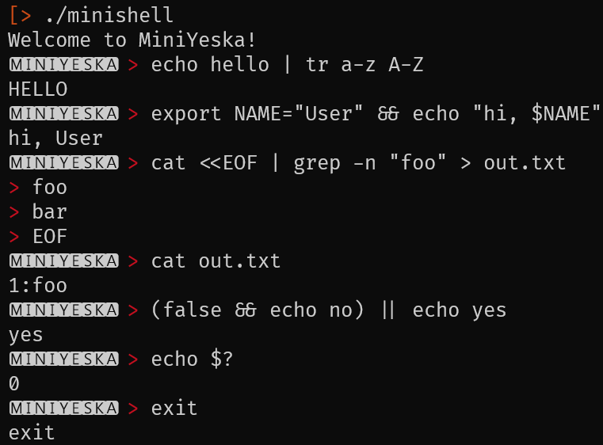

<p align="center">
	
	<br /> <h1 align="center">A Bull Terrier Mini and a Mini Shell too</h1>
</p>

A minimal POSIX‑like shell implemented in C as part of 42’s **Minishell** project. It supports a practical subset of <i>bash(1)</i> semantics, robust process management, and precise file descriptor and signal handling. The project includes both the mandatory requirements and the official bonus for logical operators with precedence.

## Highlights

* **Mandatory:** prompt + history (_``readline``_), path resolution, redirections (`<`, `>`, `>>`, `<<`), pipelines (`|`), environment expansion `$VAR`, special `$?`, quotes (`'`, `"`), and interactive signals (`^C`, `^D`, `^\`).
* **Bonus:** logical operators `&&`, `||` **with parentheses for precedence**.
* **Builtins:** `echo -n`, `cd`, `pwd`, `export`, `unset`, `env`, `exit`.

## Features

### Parsing & expansion

* Lexer with token classification (words, quoted words, operators, redirections, parentheses).
* Quote rules: single quotes **do not** expand; double quotes **do** expand `$`.
* Parameter expansion: `$[A-Za-z_][A-Za-z0-9_]*` and `$?`.
* Word splitting occurs after expansions in unquoted parameters, using spaces as separators (simplified Bash behavior).

### AST & execution

* Binary AST for operators: `PIPE`, `AND_IF`, `OR_IF`, with nodes for `CMD` and **subshell** nodes for `(...)` (bonus for precedence).
* Redirections attached to command nodes and applied immediately before `execve`.
* Pipelines use `pipe()` and `dup2()` to chain `stdin/stdout`, maintaining strict file descriptor hygiene.
* `wait` semantics: the shell reports the **last command** status in a pipeline; logical operators depend on child statuses.

### Builtins

* `echo [-n]` — handles `-n` accurately.
* `cd [--] [dir]` — `HOME` fallback; errors on too many args; updates `PWD`/`OLDPWD`.
* `pwd` — prints the current working directory using `getcwd()`.
* `export [KEY[=VALUE] ...]` — validates identifiers; without arguments prints variables in **alphabetical order**.
* `unset [KEY ...]` — removes keys.
* `env` — prints environment variables without options.
* `exit [n]` — numeric parsing, `too many arguments` handling, `--` as end‑of‑options.

### Redirections

* `<`, `>`, `>>` — open/dup2/close handled with error checking.
* `<<` (heredoc) — reads until delimiter (history not updated). Signals handled gracefully during heredoc input.

### Signals (interactive UX)

* **Parent (shell):** `SIGINT` prints a fresh prompt; `SIGQUIT` ignored.
* **Children:** `SIGINT`/`SIGQUIT` restored to default for standard command behavior (e.g., `cat` stopped by `^C`, `Quit (core dumped)` on `^\`). On signal termination, `$? = 128 + signal`.

## Example

<p align="center">
	
</p>

## What’s intentionally out of scope

* Expansion of undefined variables does not create or declare new environment entries; variables can only be created explicitly with export.
* Advanced parameter expansion: `${...}`, `${var@Q}`, `${#var}`, etc.
* Command substitution: `$(...)` / backticks.
* Arithmetic expansion: `$(( ... ))`.
* Bash‑specific quoting: `$'...'`, `$"..."` (gettext/ANSI‑C).
* Job control (`fg`, `bg`, `jobs`).
* Globbing beyond the required scope (wildcards handled for current dir **only** when bonus enabled).


## Build & run

### Requirements

* **Compiler**: `clang` with `-Wall -Wextra -Werror`.
* **GNU Readline** development headers.
* **Make** (provided Makefile targets: `all`, `clean`, `fclean`, `re`, `dev`, `debug`).

> The project adheres to the allowed‑functions constraint from the [subject]("https://cdn.intra.42.fr/pdf/pdf/135352/es.subject.pdf") (`readline`, `fork/exec`, `dup/pipe`, etc.).

### Linux (Debian/Ubuntu)

#### Prerequisites
```bash
sudo apt-get update && sudo apt-get install -y build-essential libreadline-dev
```
#### Build & run
```bash
make # or make debug, make dev
./miniyeska
```

## Why this project matters

* Processes & pipelines: fork/exec, pipe, dup2, wait/waitpid.
* Descriptors: lifetime, error‑safe closing, redirection discipline.
* Signals: per‑process actions and terminal group management.
* Parsing: correct tokenization, AST, and operator precedence.
* Error handling and exceptional memory cleanup.
